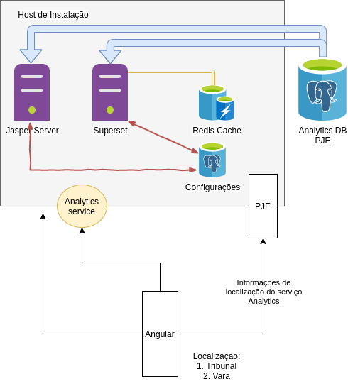

# Módulo de BI

O módulo de BI é composto por dois principais produtos e um serviço:

1. [Apache Superset](https://superset.incubator.apache.org/);

2. [Jasper Reports Server](https://community.jaspersoft.com/project/jasperreports-server);

3. Analytics service.

Tanto o Superset quanto o Jasperserver precisam de um banco de dados para salvar suas configurações.
Dessa forma, no pacote de instalção há também um banco de dados PostgreSQL.

O Superset é uma solução escalável e voltada para apresentação de uma quantidade massiva de dados. Dessa forma,
por projeto, ela não armazena dados *in memory*. Para que haja uma melhor performance em consultas,
o [Redis cache](https://redis.io/) é utilizado em paralelo fornecendo cache de dados para o Superset.

A solução de BI do PJE contém alguns relatórios pré disponibilizados que ajudarão o Tribunal que adotar a solução
na elaboração de novos relatórios/dashboards, bem como poderão ser utilizados logo a partir da instalação.

A arquitetura do módulo de BI é a seguinte:

## Instalação

A instalação se dará em duas etapas:

### 1. Instalação dos produtos

Para instalação dos produtos, são necessários o Docker e o Docker-compose na máquina hospedeira, além de acesso à internet,
pois o instalador baixará imagens docker da Internet.

Dois arquivos deverão ser baixados para a máquina hospedeira:

1. Configuraçẽos e *docker volumes* dos produtos: esse arquivo poderá ser baixado a partir de um repositório do CNJ.
   Poderá ser feito o download via **browser/curl** [https://cnj-superset.s3-sa-east-1.amazonaws.com/pjeanalytics-0.1.1.zip](https://cnj-superset.s3-sa-east-1.amazonaws.com/pjeanalytics-0.1.1.zip)
   ou por AWS CLI no endereço s3://cnj-superset/pjeanalytics-0.1.0.zip;

2. Docker volumes do banco de configuração inicial: esse arquivo contém os volumes do banco de dados de configuração dos produtos, bem como o repositório do Redis cache.
   Da mesma forma, poderá ser feito o download via **browser/curl** [https://cnj-superset.s3-sa-east-1.amazonaws.com/store-0.1.0.zip](https://cnj-superset.s3-sa-east-1.amazonaws.com/store-0.1.0.zip)
   ou por AWS CLI no endereço s3://cnj-superset/store-0.1.0.zip.

| Pacote | versão mais recente | propósito | S3 | change log |
| :---: | :---: | :---: | :---: | :---: |
| pjeanalytics | 0.1.1 | produto e configurações gerais| s3://cnj-superset/pjeanalytics-0.1.1.zip | pjeanalytics change log |
| store | 0.1.0 | configurações de dashboards e relatórios | s3://cnj-superset/store-0.1.0.zip | store change log |

Obs: para instalar o AWS CLI, siga as instruções no link [https://docs.aws.amazon.com/cli/latest/userguide/cli-chap-install.html](https://docs.aws.amazon.com/cli/latest/userguide/cli-chap-install.html)

Passos:

a. Para a instalação, o arquivo baixado no passo 1 acima deverá ser descompactado no diretório de destino. Ele irá criar uma pasta *pje* com os arquivos do produto dentro.

b. O arquivo baixado no passo 2 deverá ser descompactado **dentro da pasta pje criada ao descompactar o arquivo anterior**. Esse processo vai gerar uma pasta *store* dentro da pasta  *pje* anterior.

c. Dentro da pasta *pje*, rodar o docker compose. Comando: `docker-compose up`. O processo de instalação e inicialização terá inicio.

Após alguns minutos, o superset e o Jasper Server estarão rodando na máquina hospedeira.

Os serviços utilizarão as seguintes portas no hospedeiro:

| Serviço | porta |
| :---: | :---: |
| Redis Cache | 6379 |
| PostgreSQL | 5432 |
| Superset | 8088 |
| Jasper Server | 8090 |
| Jasper Server HTTPS| 8493 |
| Analytics Server | 8080 |

Para testar o Jasper Server e o Superset, basta entrar em seus ambientes via Browser:

1. Superset: http://`<host>`:8088/
2. Jasper Server: http://`<host>`:8090/

Usuário e senha default:

| Serviço | usuário | senha |
| :---: | :---: | :---: |
| PostgreSQL | superset | superset |
| Superset | admin | admin |
| Jasper Server | jasperadmin | jasperadmin |

Obs: essas senhas deverão ser alteradas tanto para o *Superset*, quanto para o *Jasper Server* para que haja uma melhor segurança.

### 2. Instalação dos scripts de banco de dados para o PJE

* **enumerar os scripts de instalação de banco de dados para analytics no PJE**;

* **criar python de instalação desses scripts e instruções de execução**.

### 3. Considerações finais

Algumas considerações importantes:

* Como a arquitetura do PJE2-WEB necessita embutir essas ferramentas dentro do IFrame Angular, será necessário
  disponibilizar o Superset e o Jasper Server na Internet.
